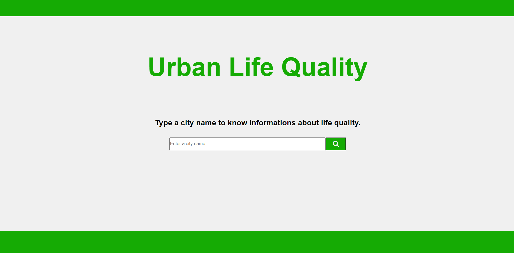

# life-quality

Project made by using https://developers.teleport.org/ APIs, where you can get informations about quality life of a city by entering its name in the search bar.

Features: manipulation and validation of the input.

Link to project deployed on Netlify: https://urban-life-quality.netlify.app/
